# Laporan Praktikum Pemrograman Mobile 
# Modul 2 : Pengantar Bahasa Pemrograman Dart – Bagian 2

## Nama     : Zaki Lazuardi Ferysa Putra
## Nim      : 2241720101
## Kelas    : TI-3B / 27
<br>

## Praktikum 1 : Menerapkan Control Flows ("if/else")

### Langkah 1 :
Ketik atau salin kode program berikut ke dalam fungsi `main()`.

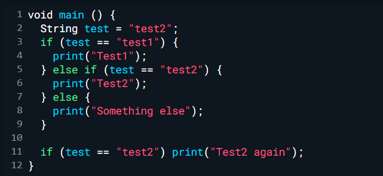

### Langkah 2 :
Silahkan coba eksekusi (Run) kode pada langkah 1 tersebut. Apa yang terjadi? Jelaskan!

<b> Jawab : </b>

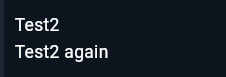 

Karena variabel test bernilai "test2", kondisi kedua akan dipenuhi, sehingga "Test2" dicetak. Lalu, perintah if juga dapat ditulis dalam satu baris seperti if terakhir, karena kondisi if terakhir juga terpenuhi, maka "Test2 again" dicetak lagi. 

### Langkah 3 :
Tambahkan kode program berikut, lalu coba eksekusi (Run) kode Anda.

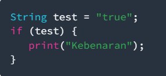

Apa yang terjadi ? Jika terjadi error, silakan perbaiki namun tetap menggunakan if/else.

<b>Jawab : </b>

- Hasil

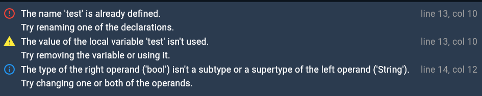

Hasilnya akan terjadi error seperti pada gambar.            

- Perbaikan Kode Program

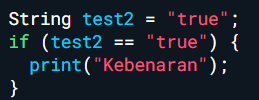

- Hasil Perbaikan

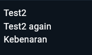

## Praktikum 2 : Menerapkan Perulangan "while" dan "do-while"
### Langkah 1 :
Ketik atau salin kode program berikut ke dalam fungsi `main()`.

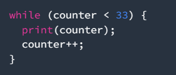

### Langkah 2:
Silakan coba eksekusi (Run) kode pada langkah 1 tersebut. Apa yang terjadi? Jelaskan! Lalu perbaiki jika terjadi error.

<b>Jawab : </b>

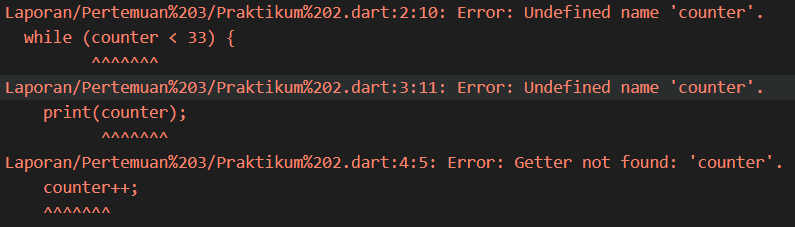

Terjadi error dikarenakan tidak terdapat variable 'Counter'. Maka perlu dideklarasikan terlebih dahulu, seperti dibawah ini :

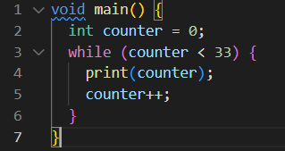

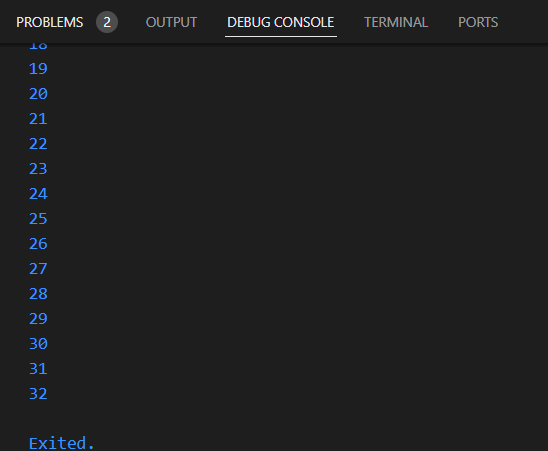

### Langkah 3 :
Tambahkan kode program berikut, lalu coba eksekusi (Run) kode Anda.

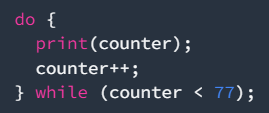

Apa yang terjadi ? Jika terjadi error, silakan perbaiki namun tetap menggunakan do-while.

<b>Jawab : </b>

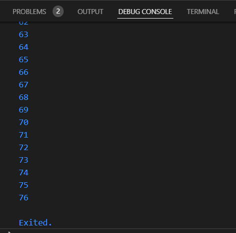

Tidak terjadi error. Jika kode program belum diperbaiki seperti di langkah sebelumnya, maka error yang terjadi juga sama, yaitu tidak terdapat variable bernama 'counter'.

## Praktikum 3: Menerapkan Perulangan "for" dan "break-continue"
### Langkah 1 :
Ketik atau salin kode program berikut ke dalam fungsi `main()`.

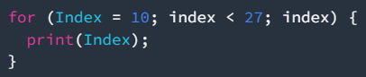

### Langkah 2 :
Silakan coba eksekusi (Run) kode pada langkah 1 tersebut. Apa yang terjadi? Jelaskan! Lalu perbaiki jika terjadi error.

<b>Jawab : </b>

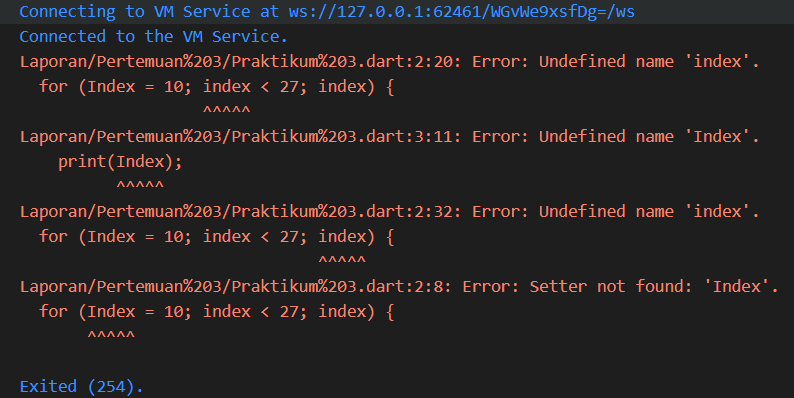

Terjadi error karena tidak terdapat variable bernama 'Index' dan 'index', dan juga tidak terdapat setter pada perulangan. Maka perlu diperbaiki seperti dibawah ini :

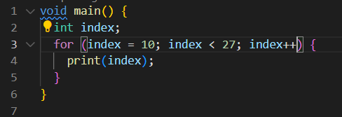

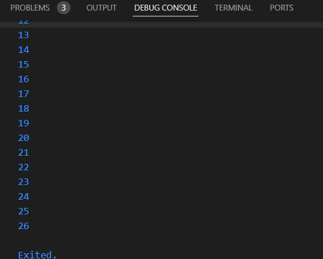

### Langkah 3 :
Tambahkan kode program berikut di dalam for-loop, lalu coba eksekusi (Run) kode Anda.

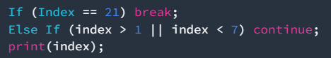

Apa yang terjadi ? Jika terjadi error, silakan perbaiki namun tetap menggunakan for dan break-continue.

<b>Jawab : </b>


Terdapat error, maka perlu diperbaiki seperti dibawah ini :

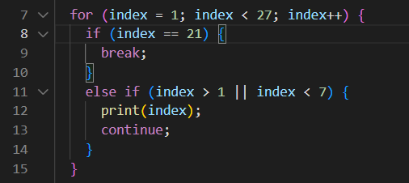

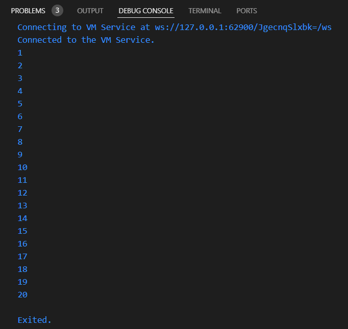

## Tugas Praktikum
Buatlah sebuah program yang dapat menampilkan bilangan prima dari angka 0 sampai 201 menggunakan Dart. Ketika bilangan prima ditemukan, maka tampilkan nama lengkap dan NIM Anda.

- Kode Program :
```dart
void main() {
  String nama = "Zaki Lazuardi Ferysa Putra";  
  String nim = "2241720101";            
  
  // Fungsi untuk mengecek apakah sebuah bilangan adalah prima
  bool isPrime(int num) {
    if (num < 2) return false;
    for (int i = 2; i <= num ~/ 2; i++) {
      if (num % i == 0) return false;
    }
    return true;
  }
  
  // Looping untuk mengecek setiap bilangan dari 0 sampai 201
  for (int i = 0; i <= 201; i++) {
    if (isPrime(i)) {
      print("$i adalah bilangan prima");
      print("Nama: $nama");
      print("NIM: $nim\n");
    }
  }
}
```

- Hasil :
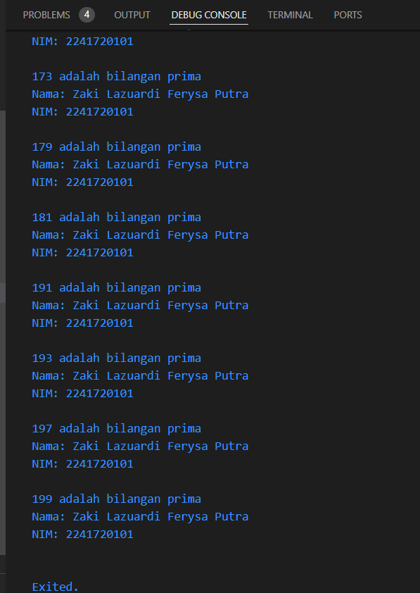