# Laporan Praktikum Pemrograman Mobile 
# Modul 4 : Pengantar Bahasa Pemrograman Dart – Bagian 3

## Nama     : Zaki Lazuardi Ferysa Putra
## Nim      : 2241720101
## Kelas    : TI-3B / 27
<br>

## Praktikum 1 : Eksperimen Tipe Data List

### Langkah 1 :
Ketik atau salin kode program berikut ke dalam `void main()`.
```dart
var list = [1, 2, 3];
assert(list.length == 3);
assert(list[1] == 2);
print(list.length);
print(list[1]);

list[1] = 1;
assert(list[1] == 1);
print(list[1]);
```

### Langkah 2 :
Silakan coba eksekusi (Run) kode pada langkah 1 tersebut. Apa yang terjadi? Jelaskan!

<b> Jawab : </b>

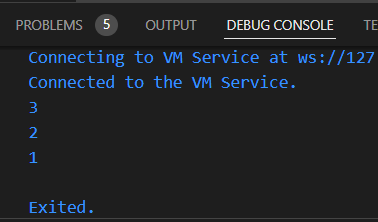

- Kode Dart yang diberikan berfungsi untuk membuat sebuah list dengan tiga elemen, yaitu `[1, 2, 3]`. Pada awalnya, program memeriksa apakah panjang list benar-benar tiga menggunakan pernyataan `assert`, yang mana valid dan program berjalan tanpa masalah. Setelah itu, pernyataan `assert` berikutnya memverifikasi apakah elemen kedua dari list adalah `2`, dan hasilnya juga benar sehingga program terus berlanjut. Kemudian, program mencetak panjang list, yaitu `3`, dan elemen kedua, yaitu `2`. Selanjutnya, elemen kedua dari list diubah dari `2` menjadi `1`. Perubahan ini juga diverifikasi dengan pernyataan `assert`, memastikan bahwa elemen kedua kini bernilai `1`. Akhirnya, program mencetak elemen kedua yang telah berubah, yaitu `1`. Karena semua `assert` valid, tidak ada error, dan hasil yang dicetak adalah `3`, `2`, dan `1`.

### Langkah 3 :
Ubah kode pada langkah 1 menjadi variabel final yang mempunyai index = 5 dengan default value = null. Isilah nama dan NIM Anda pada elemen index ke-1 dan ke-2. Lalu print dan capture hasilnya.

Apa yang terjadi ? Jika terjadi error, silakan perbaiki.

<b> Jawab : </b>

- Kode Program :
```dart
void main() {
  final List list = List.filled(5, null);  
  list[1] = "Zaki Lazuardi";                   
  list[2] = "2241720101";                    

  print(list);                             
}
```

- Hasil:

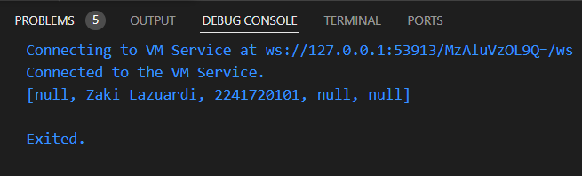

## Praktikum 2 : Eksperimen Tipe Data Set

### Langkah 1 :
Ketik atau salin kode program berikut ke dalam fungsi `main()`.
```dart
var halogens = {'fluorine', 'chlorine', 'bromine', 'iodine', 'astatine'};
print(halogens);
```

### Langkah 2 :
Silakan coba eksekusi (Run) kode pada langkah 1 tersebut. Apa yang terjadi? Jelaskan! Lalu perbaiki jika terjadi error.

<b> Jawab : </b>

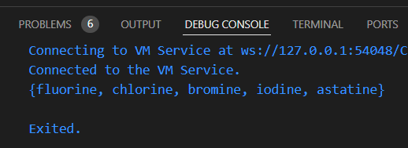

- Kode Dart tersebut mendeklarasikan sebuah `Set` bernama `halogens` yang berisi lima elemen: `'fluorine'`, `'chlorine'`, `'bromine'`, `'iodine'`, dan `'astatine'`. `Set` adalah koleksi elemen unik yang tidak berurutan, sehingga urutan pencetakan elemen bisa berbeda setiap kali program dijalankan. Kode ini kemudian mencetak isi `Set` menggunakan `print()`. Eksekusi berjalan tanpa error, dan hasilnya menampilkan elemen-elemen dalam `Set`, meskipun urutannya tidak dijamin.

### Langkah 3 :
Tambahkan kode program berikut, lalu coba eksekusi (Run) kode Anda.
```dart
var names1 = <String>{};
Set<String> names2 = {}; // This works, too.
var names3 = {}; // Creates a map, not a set.

print(names1);
print(names2);
print(names3);
```

Apa yang terjadi ? Jika terjadi error, silakan perbaiki namun tetap menggunakan ketiga variabel tersebut. 

<b> Jawab : </b>

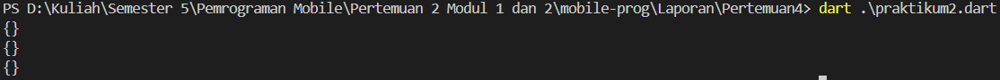

Tambahkan elemen nama dan NIM Anda pada kedua variabel Set tersebut dengan dua fungsi berbeda yaitu .add() dan .addAll(). Untuk variabel Map dihapus, nanti kita coba di praktikum selanjutnya.

<b> Jawab : </b>

- Kode Program :
```dart
void main() {
  var names1 = <String>{};              
  Set<String> names2 = {};              

  // Menambahkan nama dan NIM ke Set names1 menggunakan fungsi .add()
  names1.add("Zaki Lazuardi");
  names1.add("2241720101");

  // Menambahkan nama dan NIM ke Set names2 menggunakan fungsi .addAll()
  names2.addAll({"Zaki Lazuardi", "2241720101"});

  print(names1);
  print(names2);
}
```

- Hasil :

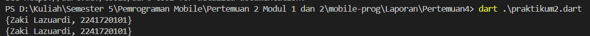

## Praktikum 3 : Eksperimen Tipe Data Maps

### Langkah 1 :
Ketik atau salin kode program berikut ke dalam fungsi `main()`.
```dart
var gifts = {
  // Key:    Value
  'first': 'partridge',
  'second': 'turtledoves',
  'fifth': 1
};

var nobleGases = {
  2: 'helium',
  10: 'neon',
  18: 2,
};

print(gifts);
print(nobleGases);
```

### Langkah 2 :
Silakan coba eksekusi (Run) kode pada langkah 1 tersebut. Apa yang terjadi? Jelaskan! Lalu perbaiki jika terjadi error.

<b> Jawab : </b>

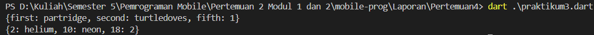

- Kode Dart tersebut mendefinisikan dua *map* yang menyimpan pasangan *key-value*. Map `gifts` menggunakan *key* bertipe `String` seperti `'first'`, `'second'`, dan `'fifth'`, dengan *value* berupa *String* (`'partridge'`, `'turtledoves'`) dan *integer* (1). Sedangkan map `nobleGases` menggunakan *key* bertipe angka, seperti `2`, `10`, dan `18`, dengan *value* berupa *String* (`'helium'`, `'neon'`) dan *integer* (2). Saat kode dijalankan, program akan mencetak isi kedua *map* tersebut tanpa error, menampilkan pasangan *key-value* dari masing-masing map.

### Langkah 3 :
Tambahkan kode program berikut, lalu coba eksekusi (Run) kode Anda.
```dart
var mhs1 = Map<String, String>();
gifts['first'] = 'partridge';
gifts['second'] = 'turtledoves';
gifts['fifth'] = 'golden rings';

var mhs2 = Map<int, String>();
nobleGases[2] = 'helium';
nobleGases[10] = 'neon';
nobleGases[18] = 'argon';
```

Apa yang terjadi ? Jika terjadi error, silakan perbaiki.

<b> Jawab : </b>

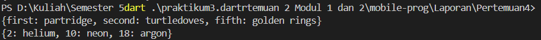

- Kode ini berhasil menambahkan elemen pada map `gifts` dan `nobleGases`, serta mendeklarasikan dua map baru `(mhs1 dan mhs2)` yang tetap kosong. Penambahan nilai pada `gifts` memperbarui nilai untuk key `fifth`, sedangkan nilai pada key di `nobleGases` diubah sesuai dengan yang ditentukan. Semua map dicetak tanpa error, menunjukkan perubahan yang telah dilakukan.


Tambahkan elemen nama dan NIM Anda pada tiap variabel di atas (gifts, nobleGases, mhs1, dan mhs2).

<b> Jawab : </b>

- Kode Program :

```dart
void main() {
  var gifts = {
    'Nama': 'Zaki Lazuardi Ferysa Putra',
    'NIM': '2241720101'
  };

  var nobleGases = {
    1: 'Zaki Lazuardi Ferysa Putra',
    2: '2241720101'
  };

  var mhs1 = Map<String, String>();
  mhs1['Nama'] = 'Zaki Lazuardi Ferysa Putra';
  mhs1['NIM'] = '2241720101';

  var mhs2 = Map<int, String>();
  mhs2[1] = 'Zaki Lazuardi Ferysa Putra';
  mhs2[2] = '2241720101';

  print(gifts);
  print(nobleGases);
  print(mhs1);
  print(mhs2);
}
```

- Hasil :

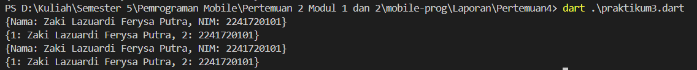

## Praktikum 4 : Eksperimen Tipe Data List : Spread dan Control-flow Operators
### Langkah 1 :
Ketik atau salin kode program berikut ke dalam fungsi `main()`.
```dart
var list = [1, 2, 3];
var list2 = [0, ...list];
print(list1);
print(list2);
print(list2.length);
```

### Langkah 2 :
Silakan coba eksekusi (Run) kode pada langkah 1 tersebut. Apa yang terjadi? Jelaskan! Lalu perbaiki jika terjadi error.

<b> Jawab : </b>

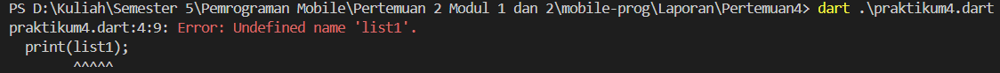

- Terjadi error karena tidak terdapat variable bernama `list1`. Maka perlu diperbaiki seperti berikut :

```dart
void main() {
  var list1 = [1, 2, 3];
  var list2 = [0, ...list1];
  print(list1);
  print(list2);
  print(list2.length);
}
```

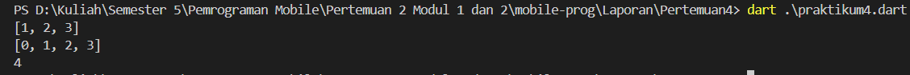

### Langkah 3 :
Tambahkan kode program berikut, lalu coba eksekusi (Run) kode Anda.

```dart
list1 = [1, 2, null];
print(list1);
var list3 = [0, ...?list1];
print(list3.length);
```
Apa yang terjadi ? Jika terjadi error, silakan perbaiki.

<b> Jawab : </b>

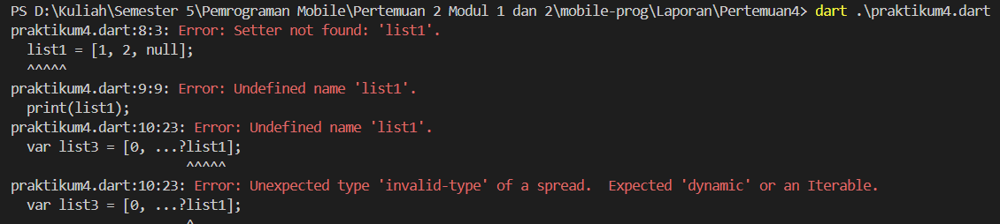

- Terjadi error seperti pada gambar

Tambahkan variabel list berisi NIM Anda menggunakan Spread Operators. Dokumentasikan hasilnya dan buat laporannya!

<b> Jawab : </b>

- Kode Program :
```dart
void main() {
  List<int?> list1 = [1, 2, 3];
  var list2 = [0, ...list1];
  print(list1);
  print(list2);
  print(list2.length);

  list1 = [1, 2, null];
  print(list1);
  var list3 = [0, ...list1];
  print(list3.length);

  // Menambahkan NIM Anda menggunakan Spread Operator
  var nim1 = [2,2,4,1,7];
  var nim2 = [2,0,1,0,1];  
  var list4 = [...nim1, ...nim2];  

  print(list4);  
}
```

- Hasil :

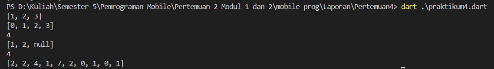

### Langkah 4 :
Tambahkan kode program berikut, lalu coba eksekusi (Run) kode Anda.
```dart
var nav = ['Home', 'Furniture', 'Plants', if (promoActive) 'Outlet'];
print(nav);
```
Apa yang terjadi ? Jika terjadi error, silakan perbaiki.

<b> Jawab : </b>

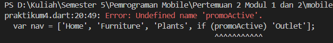

- Terjadi error karena variabel `promoActive` tidak memiliki nilai boolean. 

Tunjukkan hasilnya jika variabel promoActive ketika true dan false.

<b> Jawab : </b>

- Kode Program :
```dart
var promoActive = true;
  var nav = ['Home', 'Furniture', 'Plants', if (promoActive) 'Outlet'];
  print(nav);
```

- Hasil :

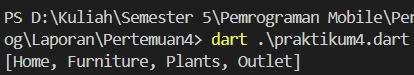

### Langkah 5 :
Tambahkan kode program berikut, lalu coba eksekusi (Run) kode Anda.
```dart
var nav2 = ['Home', 'Furniture', 'Plants', if (login case 'Manager') 'Inventory'];
print(nav2);
```
Apa yang terjadi ? Jika terjadi error, silakan perbaiki.

<b> Jawab : </b>

- Maka terjadi error dikarenakan variabel `login` tidak memiliki nilai string.

Tunjukkan hasilnya jika variabel login mempunyai kondisi lain.

<b> Jawab : </b>

- Kode Program :
```dart
var login = 'Manager';
  var nav2 = ['Home', 'Furniture', 'Plants', if (login case 'Manager') 'Inventory'];
  print(nav2);
```

- Hasil :

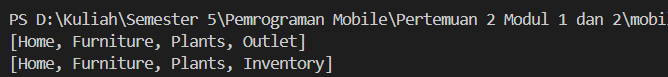

### Langkah 6 :
Tambahkan kode program berikut, lalu coba eksekusi (Run) kode Anda.
```dart
var listOfInts = [1, 2, 3];
var listOfStrings = ['#0', for (var i in listOfInts) '#$i'];
assert(listOfStrings[1] == '#1');
print(listOfStrings);
```
Apa yang terjadi ? Jika terjadi error, silakan perbaiki. Jelaskan manfaat Collection For dan dokumentasikan hasilnya.

<b> Jawab : </b>

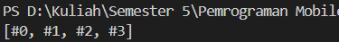

- Kode Dart menggunakan *collection for* untuk membuat list baru bernama `listOfStrings` dari elemen di `listOfInts`, yang berisi integer `[1, 2, 3]`. Dengan menambahkan elemen awal `'#0'` dan mengiterasi setiap integer, kode menghasilkan format string seperti `'#1'`, `'#2'`, dan `'#3'`. Assert digunakan untuk memverifikasi bahwa elemen kedua dari `listOfStrings` adalah `'#1'`, dan hasil akhirnya adalah `['#0', '#1', '#2', '#3']`. Manfaat utama dari *collection for* termasuk keterbacaan yang lebih baik, penggabungan elemen dengan mudah, dan efisiensi dalam penulisan kode, sehingga membuat proses pengembangan lebih cepat dan sederhana.

## Praktikum 5 : Eksperimen Tipe Data Records

### Langkah 1 : 
Ketik atau salin kode program berikut ke dalam fungsi `main()`.
```dart
var record = ('first', a: 2, b: true, 'last');
print(record)
```

### Langkah 2 :
Silakan coba eksekusi (Run) kode pada langkah 1 tersebut. Apa yang terjadi? Jelaskan! Lalu perbaiki jika terjadi error.

<b> Jawab : </b>

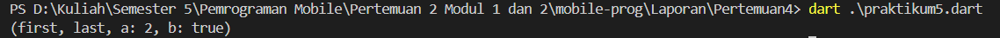

- Records memungkinkan penyimpanan beberapa nilai dalam satu entitas tanpa perlu membuat kelas khusus. Dalam kode tersebut, *record* berisi empat elemen: dua elemen posisi (`'first'` dan `'last'`) serta dua elemen dengan label (`a: 2` dan `b: true`). Ketika program dijalankan, `print(record)` akan mencetak seluruh isi *record*, menampilkan hasil `('first', a: 2, b: true, 'last')`. Fitur *record* mempermudah pengelompokan data secara sederhana dan efisien tanpa mendefinisikan tipe khusus.

### Langkah 3 :
Tambahkan kode program berikut di luar scope `void main()`, lalu coba eksekusi (Run) kode Anda.

```dart
(int, int) tukar((int, int) record) {
  var (a, b) = record;
  return (b, a);
}
```

Apa yang terjadi ? Jika terjadi error, silakan perbaiki. Gunakan fungsi `tukar()` di dalam `main()` sehingga tampak jelas proses pertukaran value field di dalam Records.

<b> Jawab : </b>

- Terjadi error karena tipe data yang diminta tidak sesuai. Maka perlu diperbaiki seperti berikut :

- Kode Program :
```dart
void main() {
  var record = (2, 5);
  print(record);

  print(tukar(record));
}

(int, int) tukar((int, int) record) {
  var (a, b) = record;
  return (b, a);
}
```

- Hasil : 

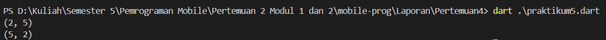


### Langkah 4 :
Tambahkan kode program berikut di dalam scope void `main()`, lalu coba eksekusi (Run) kode Anda.
```dart
// Record type annotation in a variable declaration:
(String, int) mahasiswa;
print(mahasiswa);
```

Apa yang terjadi ? Jika terjadi error, silakan perbaiki. Inisialisasi field nama dan NIM Anda pada variabel record `mahasiswa` di atas. Dokumentasikan hasilnya dan buat laporannya!

<b> Jawab : </b>

- Terjadi error karena variabel `mahasiswa` Non-nullable sehingga harus diinisialisasikan terlebih dahulu. Maka perlu diperbaiki seperti berikut :
- Kode Program :
```dart
(String, int) mahasiswa = ('Zaki Lazuardi', 2241720101);
  print(mahasiswa);
```

- Hasil :

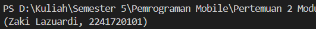

### Langkah 5 :
Tambahkan kode program berikut di dalam scope void `main()`, lalu coba eksekusi (Run) kode Anda.
```dart
var mahasiswa2 = ('first', a: 2, b: true, 'last');

print(mahasiswa2.$1); // Prints 'first'
print(mahasiswa2.a); // Prints 2
print(mahasiswa2.b); // Prints true
print(mahasiswa2.$2); // Prints 'last'
```

Apa yang terjadi ? Jika terjadi error, silakan perbaiki. Gantilah salah satu isi record dengan nama dan NIM Anda, lalu dokumentasikan hasilnya dan buat laporannya!

<b> Jawab : </b>

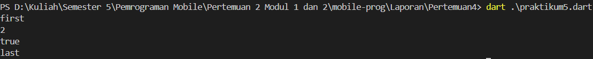

- Tidak terjadi error, hasilnya seperti gambar diatas

- Ganti Record dengan nama dan NIM
```dart
var mahasiswa2 = ('Zaki Lazuardi', a: 2241720101, b: true, 'last');

    print(mahasiswa2.$1); 
    print(mahasiswa2.a); 
    print(mahasiswa2.b); 
    print(mahasiswa2.$2); 
```

- Hasil

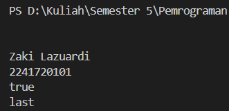

## Tugas Praktikum
1. Silakan selesaikan Praktikum 1 sampai 5, lalu dokumentasikan berupa screenshot hasil pekerjaan Anda beserta penjelasannya!

2. Jelaskan yang dimaksud Functions dalam bahasa Dart!

<b> Jawab : </b>
Function adalah blok kode yang bisa dijalankan kapan saja, memberikan hasil, dan bisa menerima parameter. Dalam Dart, fungsi memungkinkan kita untuk mengelompokkan logika kode yang berulang atau kompleks, sehingga memudahkan pemeliharaan dan penggunaan kembali (reusability). Fungsi dalam Dart ditentukan dengan kata kunci void jika tidak ada nilai yang dikembalikan atau tipe data tertentu jika mengembalikan nilai.


3. Jelaskan jenis-jenis parameter di Functions beserta contoh sintaksnya!

<b> Jawab : </b>
Dalam Dart, ada tiga jenis parameter: Positional Parameters, Optional Positional Parameters, dan Named Parameters.

- Positional Parameters: Parameter yang harus diterima fungsi dalam urutan tertentu.
```dart
void printMessage(String message) {
  print(message);
}
```

- Optional Positional Parameters: Parameter yang bersifat opsional, ditandai dengan tanda kurung siku `[]`.
```dart
void greet(String name, [String? title]) {
  if (title != null) {
    print('Hello, $title $name');
  } else {
    print('Hello, $name');
  }
}
```

- Named Parameters: Parameter yang dapat diberi nama sehingga bisa dilewati dalam urutan apa pun. Ditandai dengan `{}`.
```dart
void displayUser({required String name, int? age}) {
  print('Name: $name, Age: $age');
}
```


4. Jelaskan maksud Functions sebagai first-class objects beserta contoh sintaknya!

<b> Jawab : </b>
Dalam Dart, functions adalah first-class objects, artinya function bisa disimpan dalam variabel, diteruskan sebagai argumen ke fungsi lain, atau dikembalikan dari fungsi lain. Ini memungkinkan penggunaan fungsi secara fleksibel, seperti callback, dan fungsi tingkat tinggi.

```dart
void main() {
  Function sayHello = () {
    print('Hello!');
  };
  executeFunction(sayHello);
}

void executeFunction(Function func) {
  func();  // Menjalankan fungsi
}
```

5. Apa itu Anonymous Functions? Jelaskan dan berikan contohnya!

<b> Jawab : </b>
Anonymous functions, atau lambda expressions, adalah fungsi tanpa nama yang bisa langsung ditulis dan digunakan. Biasanya digunakan saat fungsi hanya dibutuhkan sekali atau digunakan sebagai argumen untuk fungsi lain.

Contoh :
```dart
var numbers = [1, 2, 3, 4];
numbers.forEach((number) {
  print(number * 2);
});
```

6. Jelaskan perbedaan Lexical scope dan Lexical closures! Berikan contohnya!

<b> Jawab : </b>

- Lexical Scope: Adalah aturan dimana fungsi hanya bisa mengakses variabel yang dideklarasikan dalam lingkup (scope) tempat fungsi tersebut ditulis. Contoh:
```dart
void main() {
  int x = 10;

  void printX() {
    print(x); // bisa mengakses x karena dalam lexical scope
  }

  printX();
}
```
- Lexical Closure: Adalah fitur dimana fungsi bisa "menutup" (capture) variabel dari lingkup luarnya dan mempertahankan akses ke variabel tersebut meskipun lingkup luarnya sudah tidak aktif. Contoh:
```dart
Function makeMultiplier(int factor) {
  return (int x) => x * factor; // menutup variabel factor
}

void main() {
  var multiplyBy2 = makeMultiplier(2);
  print(multiplyBy2(5)); // Output: 10
}
```


7. Jelaskan dengan contoh cara membuat return multiple value di Functions!

<b> Jawab : </b>
Dart tidak mendukung pengembalian nilai ganda secara langsung, tapi kita bisa menggunakan list, map, atau tuple-like structure seperti class atau Record (sejak Dart 3.0) untuk mengembalikan beberapa nilai dari sebuah fungsi.

Contoh menggunakan map :

```dart
Map<String, int> swap(int a, int b) { return {'first': b, 'second': a}; }

void main() { var result = swap(1, 2); print(result); // {first: 2, second: 1} }
```

Fungsi swap menukar nilai a dan b, lalu mengembalikannya dalam sebuah map dengan kunci first dan second.