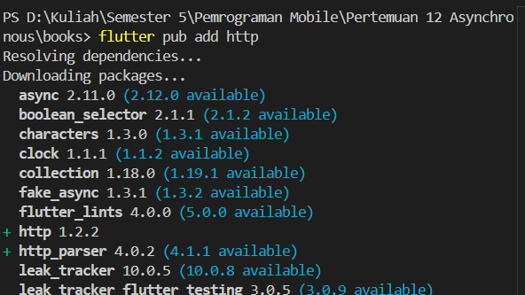
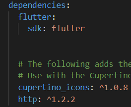
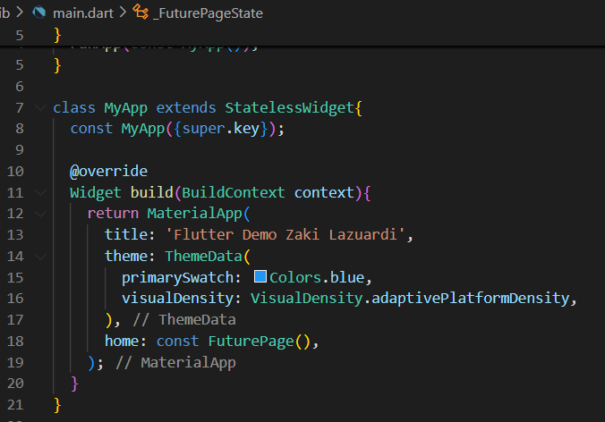
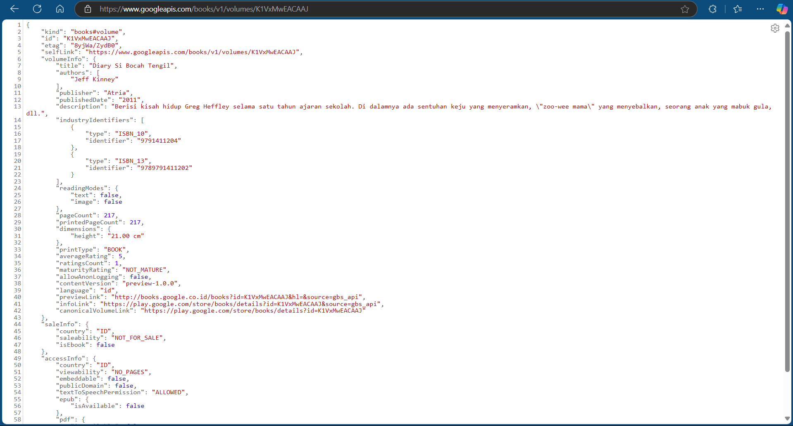
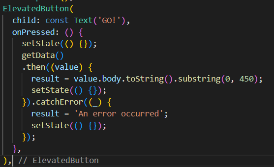
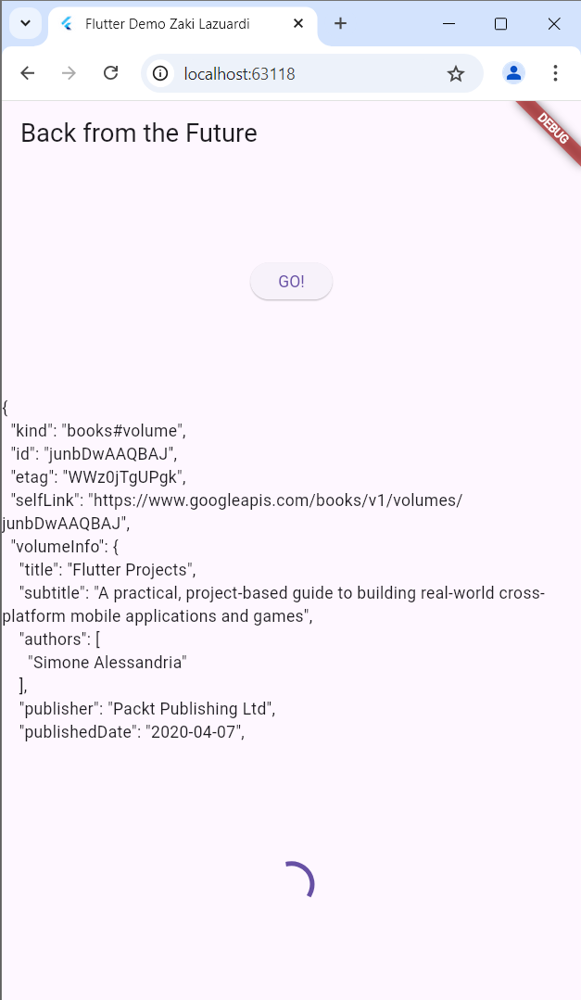
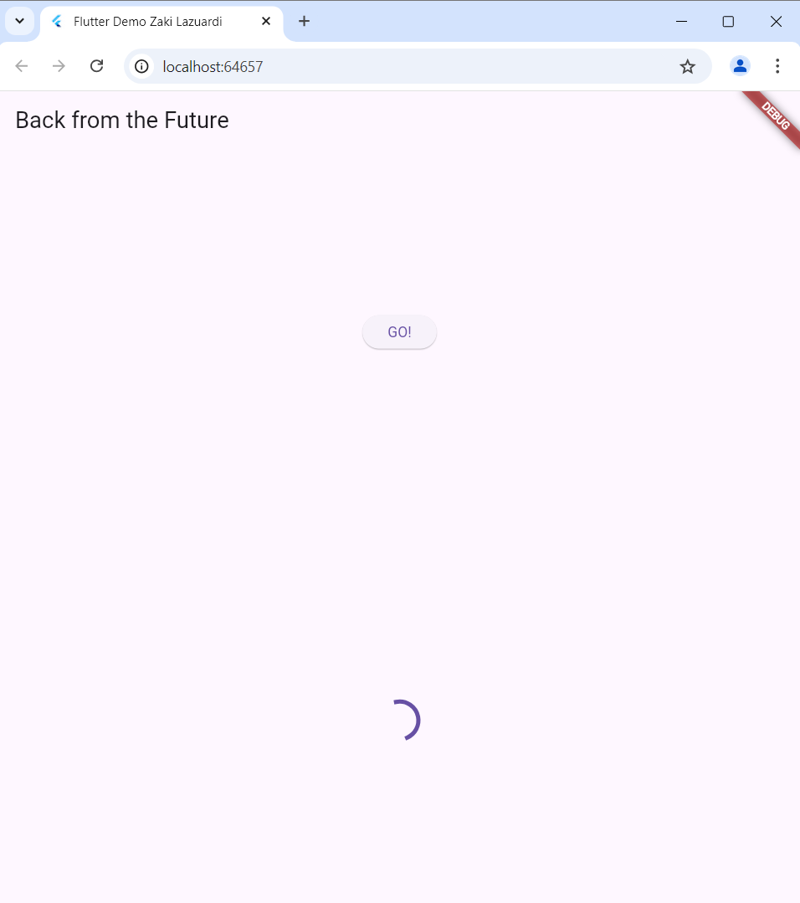
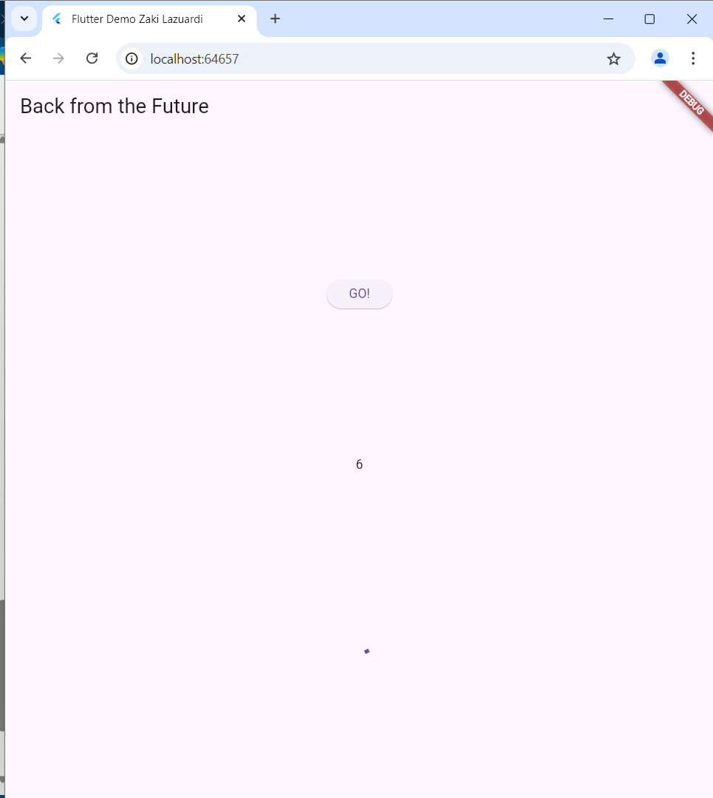
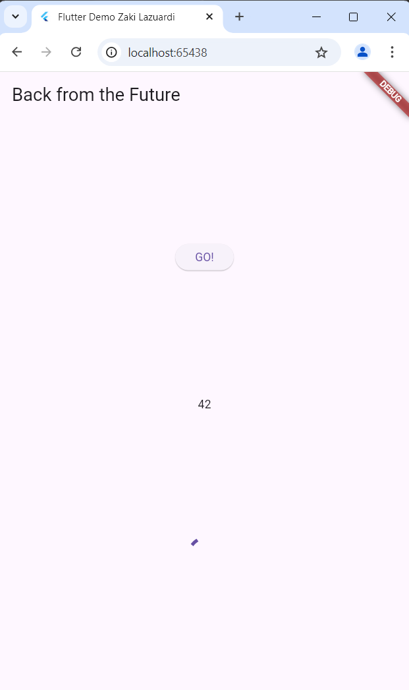
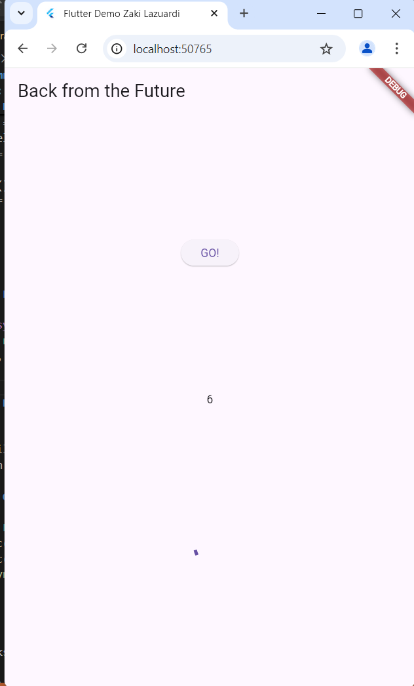

# Laporan Praktikum Pemrograman Mobile 
# Modul 12 : Pemrograman Asynchronous

## Nama     : Zaki Lazuardi Ferysa Putra
## Nim      : 2241720101
## Kelas    : TI-3B / 27

## Praktikum 1 : Mengunduh Data dari Web Service(API)
### Langkah 1 : Buat Project Baru



### Langkah 2 : Cek file pubspec.yaml



### Langkah 3 : Buat file main.dart
    Soal 1
    Tambahkan nama panggilan Anda pada title app sebagai identitas hasil pekerjaan Anda.



### Langkah 4 : Tambah method getData()
    Soal 2
    Carilah judul buku favorit Anda di Google Books, lalu ganti ID buku pada variabel path di kode tersebut. Caranya ambil di URL browser Anda seperti gambar berikut ini.
    
    Kemudian cobalah akses di browser URI tersebut dengan lengkap seperti ini. Jika menampilkan data JSON, maka Anda telah berhasil. Lakukan capture milik Anda dan tulis di README pada laporan praktikum. Lalu lakukan commit dengan pesan "W12: Soal 2".



### Langkah 5 : Tambah kode di ElevatedButton


- Hasil



    Soal 3
    Jelaskan maksud kode langkah 5 tersebut terkait substring dan catchError!
    Capture hasil praktikum Anda berupa GIF dan lampirkan di README. Lalu lakukan commit dengan pesan "W12: Soal 3".

    Jawab:
    Langkah kelima pada kode di atas menggunakan substring untuk membatasi hasil data yang ditampilkan hanya sampai 450 karakter pertama, yang diambil dari value.body setelah dikonversi menjadi string. Hal ini berguna untuk mencegah tampilan data yang terlalu panjang. Selain itu, catchError digunakan untuk menangani kemungkinan error selama pemanggilan getData(). Jika terjadi error, blok ini akan mengatur variabel result dengan pesan 'An error occurred', dan memanggil setState() agar UI dapat diperbarui sesuai dengan pesan error tersebut.

## Praktikum 2 : Menggunakan await/async untuk menghindari callbacks
### Langkah 1 : Buka file main.dart
```dart
Future<int> returnOneAsync() async {
  await Future.delayed(const Duration(seconds: 3));
  return 1;
}

Future<int> returnTwoAsync() async {
  await Future.delayed(const Duration(seconds: 3));
  return 2;
}

Future<int> returnThreeAsync() async {
  await Future.delayed(const Duration(seconds: 3));
  return 3;
}
```

### Langkah 2 : Tambah method count()
```dart
Future count() async {
    int total = 0;
    total = await returnOneAsync();
    total += await returnTwoAsync();
    total += await returnThreeAsync();
    setState(() {
      result = total.toString();
    });
  }
```

### Langkah 3 : Panggil count()
```dart
ElevatedButton(
    child: const Text('GO!'),
    onPressed: () {
        count();
    },
),
```

### Langkah 4 : Run





    Soal 4
    Jelaskan maksud kode langkah 1 dan 2 tersebut!
    Capture hasil praktikum Anda berupa GIF dan lampirkan di README. Lalu lakukan commit dengan pesan "W12: Soal 4".

    - Jawab:
    Pada Langkah 1, tiga fungsi asinkron (returnOneAsync, returnTwoAsync, dan returnThreeAsync) didefinisikan. Setiap fungsi ini akan menunggu selama 3 detik menggunakan Future.delayed, kemudian mengembalikan nilai integer (masing-masing 1, 2, dan 3). Fungsi-fungsi ini dibuat untuk mensimulasikan proses yang memakan waktu, seperti pengambilan data dari internet atau operasi berat lainnya.

    Di Langkah 2, fungsi count() ditambahkan. Fungsi ini bekerja secara asinkron untuk menghitung nilai total dari ketiga fungsi pada Langkah 1. Mula-mula, total diinisialisasi dengan nilai 0. Kemudian, total diupdate secara bertahap dengan menambahkan hasil dari returnOneAsync(), returnTwoAsync(), dan returnThreeAsync() yang masing-masing ditunggu dengan await hingga selesai. Setelah semua nilai dijumlahkan, setState() dipanggil untuk memperbarui tampilan UI dengan result yang diisi nilai total hasil penjumlahan tersebut, dalam bentuk string.

## Praktikum 3 : Menggunakan Completer di Future
### Langkah 1 : Buka main.dart
```dart
import 'package:async/async.dart';
```

### Langkah 2 : Tambahkan variabel dan method
```dart
late Completer completer;

Future getNumber() {
  completer = Completer<int>();
  calculate();
  return completer.future;
}

Future calculate() async {
  await Future.delayed(const Duration(seconds : 5));
  completer.complete(42);
}
```

### Langkah 3 : Ganti isi kode onPressed()
```dart
onPressed: () async {
                getNumber().then((value) {
                  setState(() {
                    result = value.toString();
                  });
                });
              },
```

### Langkah 4 : Run



    Soal 5
    Jelaskan maksud kode langkah 2 tersebut!
    Capture hasil praktikum Anda berupa GIF dan lampirkan di README. Lalu lakukan commit dengan pesan "W12: Soal 5".

    - Jawab:
    Pada langkah 2, kode menggunakan Completer untuk mengatur kapan sebuah Future selesai. Ketika getNumber() dipanggil, ia membuat Completer<int> dan mengembalikan completer.future, yaitu Future yang nantinya akan diselesaikan secara manual. Fungsi calculate() kemudian dijalankan secara asinkron, menunggu selama 5 detik menggunakan Future.delayed. Setelah penundaan selesai, completer.complete(42); dipanggil untuk menyelesaikan Future dengan nilai 42, sehingga siapa pun yang menunggu getNumber() akan menerima nilai 42 setelah proses selesai.

### Langkah 5 : Ganti method calculate()
```dart
Future calculate() async {
    // await Future.delayed(const Duration(seconds : 5));
    // completer.complete(42);
    try {
      await new Future.delayed(const Duration(seconds : 5));
      completer.complete(42);
    }
    catch(_) {
      completer.completeError({});
    }
  }
```

### Langkah 6 : Pindah ke onPressed()
```dart
getNumber().then((value) {
  setState(() {
    result = value.toString();
  });
}).catchError((e) {
  result = 'An error occurred';
});
```

    Soal 6
    Jelaskan maksud perbedaan kode langkah 2 dengan langkah 5-6 tersebut!
    Capture hasil praktikum Anda berupa GIF dan lampirkan di README. Lalu lakukan commit dengan pesan "W12: Soal 6".

    - Jawab :
    Perbedaan utama antara langkah 2 dan langkah 5-6 adalah penambahan mekanisme penanganan error pada calculate() dan penggunaan catchError untuk menangani error tersebut di onPressed(). Di langkah 5, kode calculate() diperbarui dengan menambahkan blok try-catch untuk menangkap kemungkinan error selama proses asinkron berlangsung. Jika berhasil, completer.complete(42); tetap dipanggil setelah 5 detik; namun, jika terjadi error, completer.completeError({}); dipanggil untuk menandakan bahwa Future berakhir dengan error. Pada langkah 6, onPressed() ditambahkan dengan pemanggilan getNumber(), diikuti oleh then() untuk menampilkan hasil dalam UI jika sukses, dan catchError() untuk menangani error dengan menampilkan pesan 'An error occurred' jika Future gagal.

## Praktikum 4 : Memanggil Future secara paralel
### Langkah 1 : Buka file main.dart
```dart
void returnFG() {
    FutureGroup<int> futureGroup = FutureGroup<int>();
    futureGroup.add(returnOneAsync());
    futureGroup.add(returnTwoAsync());
    futureGroup.add(returnThreeAsync());
    futureGroup.close();
    futureGroup.future.then((List <int> value) {
      int total = 0;
      for (var element in value) {
        total += element;
      }
      setState(() {
        result = total.toString();
      });
    });
  }
```

### Langkah 2 : Edit onPressed()
```dart
onPressed: () async {
                returnFG();
              },
```

### Langkah 3 : Run
Anda akan melihat hasilnya dalam 3 detik berupa angka 6 lebih cepat dibandingkan praktikum sebelumnya menunggu sampai 9 detik.



    Soal 7
    Capture hasil praktikum Anda berupa GIF dan lampirkan di README. Lalu lakukan commit dengan pesan "W12: Soal 7

### Langkah 4 : Ganti variabel futureGroup
```dart
final futures = Future.wait<int>([
  returnOneAsync(),
  returnTwoAsync(),
  returnThreeAsync(),
]);
```

    Soal 8
    Jelaskan maksud perbedaan kode langkah 1 dan 4!

## Praktikum 5 : Menangani Respon Error pada Async Code
### Langkah 1 : Buka file main.dart

### Langkah 2 : ElevatedButton

### Langkah 3 : Run

    Soal 9
    Capture hasil praktikum Anda berupa GIF dan lampirkan di README. Lalu lakukan commit dengan pesan "W12: Soal 9".

### Langkah 4 : Tambah method handleError()

    Soal 10
    Panggil method handleError() tersebut di ElevatedButton, lalu run. Apa hasilnya? Jelaskan perbedaan kode langkah 1 dan 4!

## Praktikum 6 : Menggunakan Future dengan StatefulWidget
### Langkah 1 : Install plugin geolocator

### Langkah 2 : Tambah permission GPS

### Langkah 3 : Buat file geolocation.dart

### Langkah 4 : Buat StatefulWidget

### Langkah 5 : Isi kode geolocation.dart

    Soal 11
    Tambahkan nama panggilan Anda pada tiap properti title sebagai identitas pekerjaan Anda.

### Langkah 6 : Edit main.dart

### Langkah 7 : Run

### Langkah 8 : Tambahkan animasi loading

    Soal 12
    Jika Anda tidak melihat animasi loading tampil, kemungkinan itu berjalan sangat cepat. Tambahkan delay pada method getPosition() dengan kode await Future.delayed(const Duration(seconds: 3));
    Apakah Anda mendapatkan koordinat GPS ketika run di browser? Mengapa demikian?
    Capture hasil praktikum Anda berupa GIF dan lampirkan di README. Lalu lakukan commit dengan pesan "W12: Soal 12".