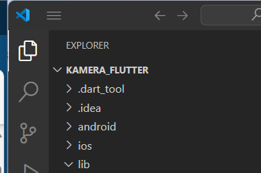
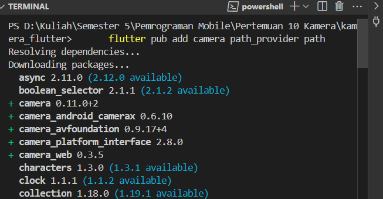
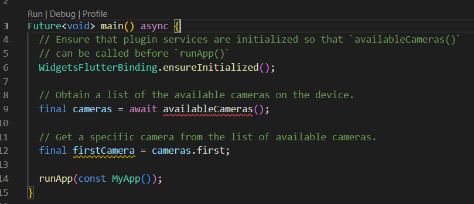
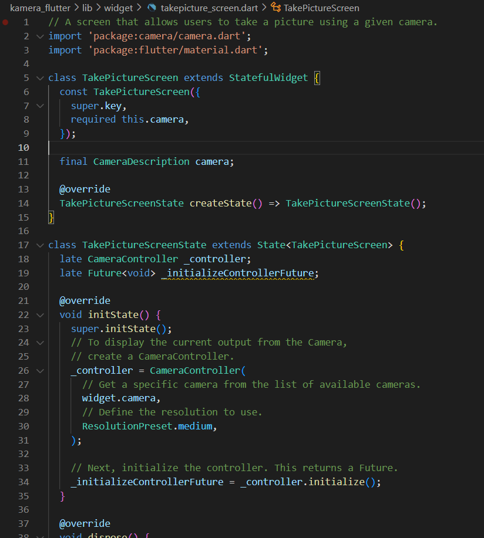
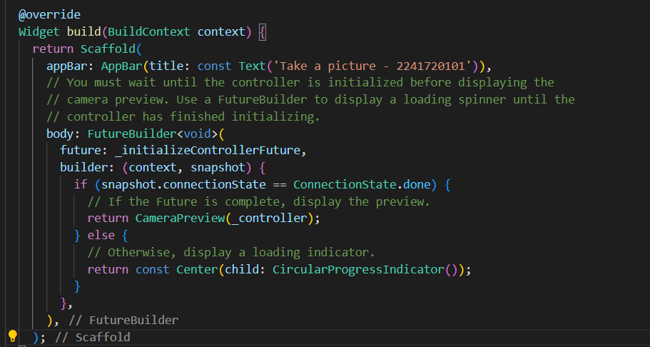
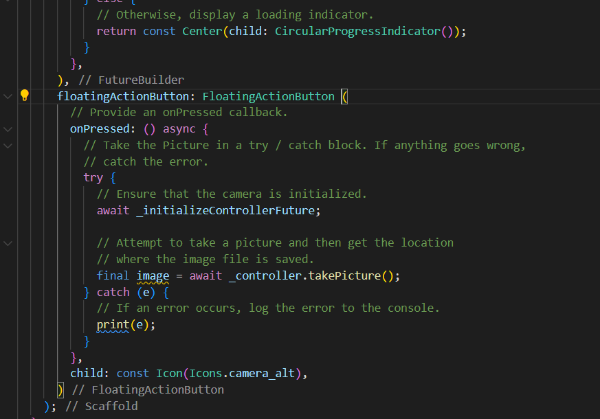
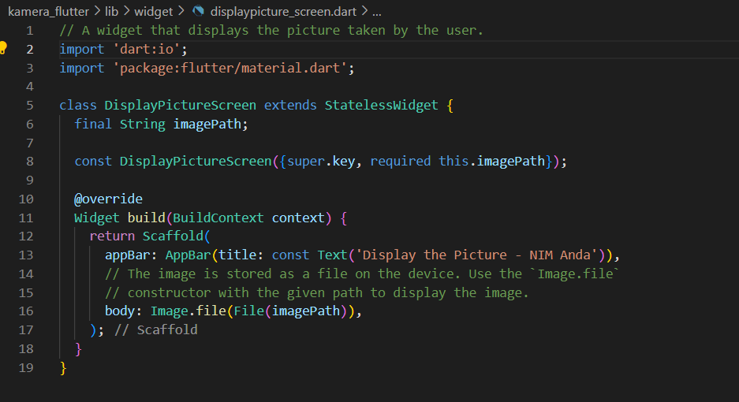
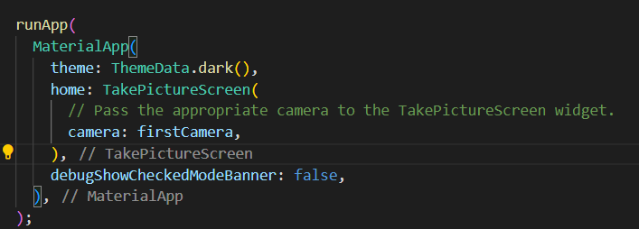
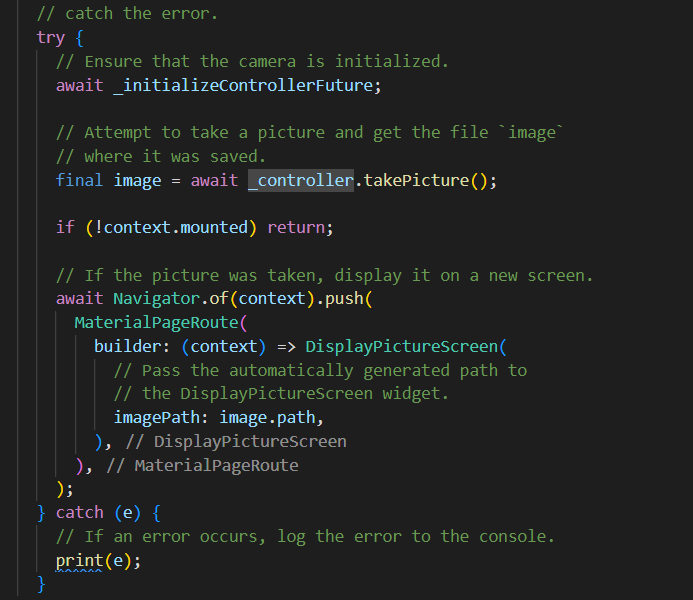
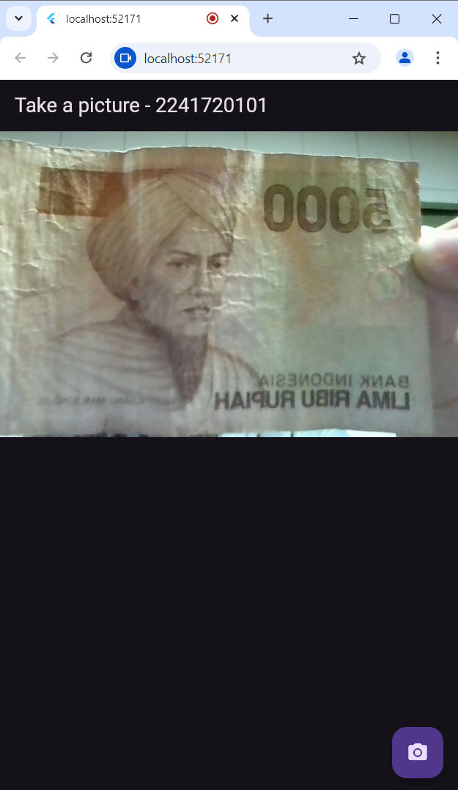

# Laporan Praktikum Pemrograman Mobile 
# Modul 9 : Kamera

## Nama     : Zaki Lazuardi Ferysa Putra
## Nim      : 2241720101
## Kelas    : TI-3B / 27

## Praktikum 1 : Mengambil Foto dengan Kamera di Flutter
### Langkah 1 : Buat Project Baru

### Langkah 2 : Tambah dependensi yang diperlukan

### Langkah 3 : Ambil Sensor Kamera dari device

### Langkah 4 : Buat dan inisialisasi CameraController

### Langkah 5 : Gunakan CameraPreview untuk menampilkan foto

### Langkah 6 : Ambil foto dengan CameraController

### Langkah 7 : Buat widget baru DisplayPictureScreen

### Langkah 8 : Edit main.dart

### Langkah 9 : Menampilkan hasil foto

- Hasil

