# Laporan Praktikum Pemrograman Mobile 
# Modul 11 : Dasar State Management

## Nama     : Zaki Lazuardi Ferysa Putra
## Nim      : 2241720101
## Kelas    : TI-3B / 27
 

## Praktikum 1 : Dasar State dengan Model-View
### Langkah 1: Buat Project Baru

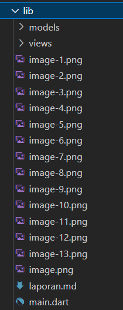

### Langkah 2 : Membuat model task.dart

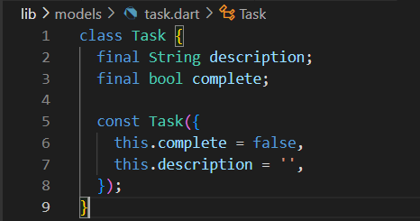

### Langkah 3 : Buat file plan.dart

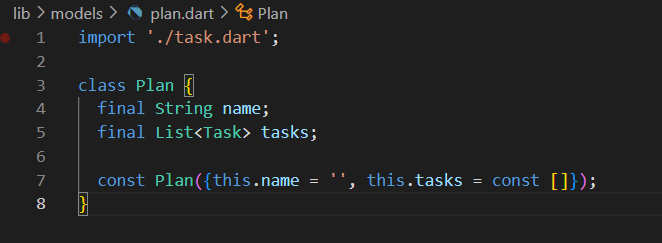

### Langkah 4 : Buat file data_layer.dart

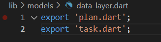

### Langkah 5 : Pindah ke file main.dart

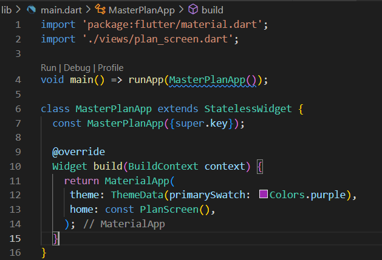

### Langkah 6 : Buat plan_screen.dart

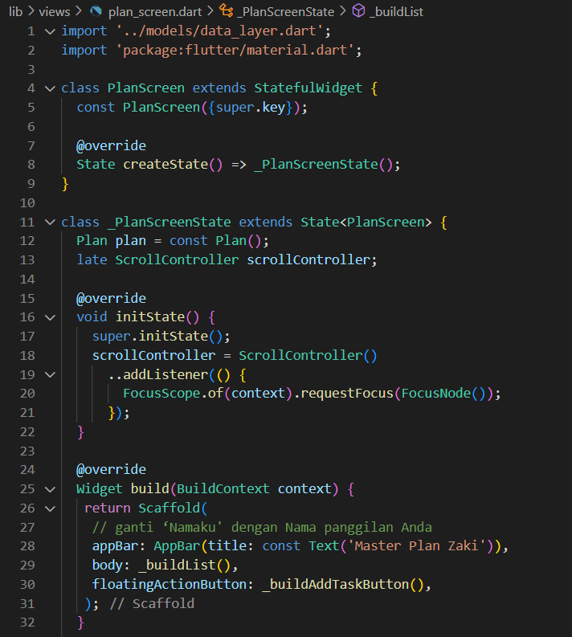

### Langkah 7 : Buat method _buildAddTaskButton()

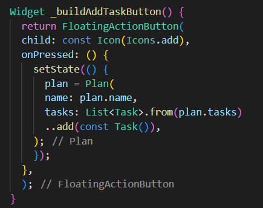

### Langkah 8 : Buat widget _buildList()

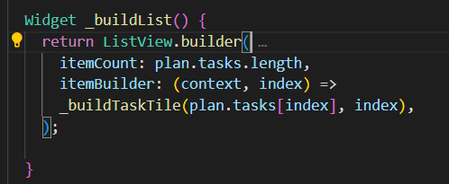

### Langkah 9 : Buat widget _buildTaskTile

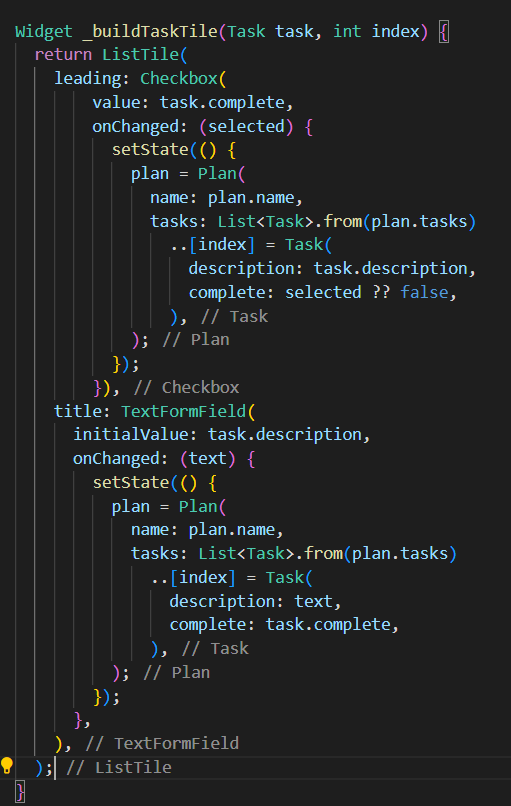

- Hasil

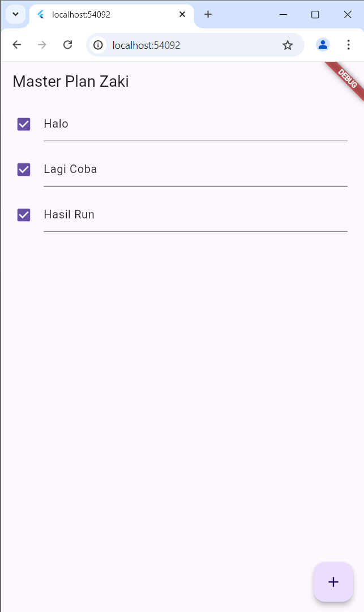

### Langkah 10 : Tambah Scroll Controller

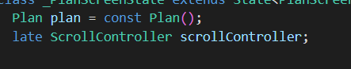

### Langkah 11 : Tambah Scroll Listener

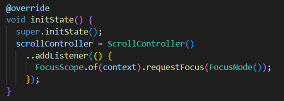

### Langkah 12 : Tambah controller dan keyboard behavior

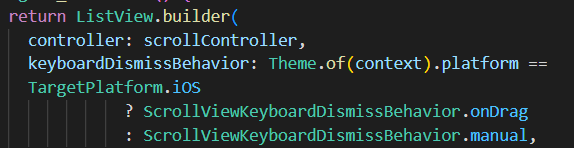

### Langkah 13 : Terakhir, tambah method dispose() 

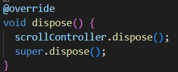

### Langkah 14 : Hasil

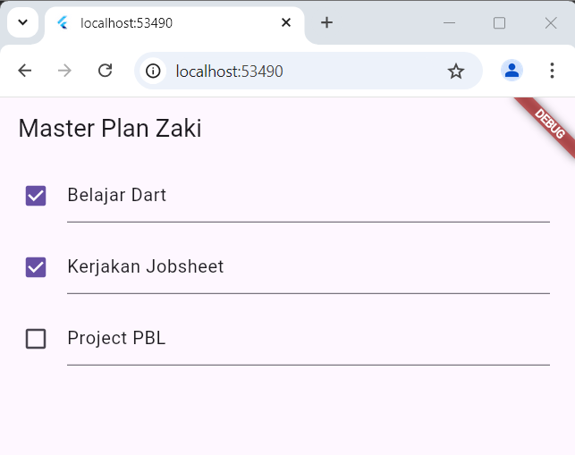

## Tugas Praktikum 1 : Dasar State dengan Model-View
1. Selesaikan langkah-langkah praktikum tersebut, lalu dokumentasikan berupa GIF hasil akhir praktikum beserta penjelasannya di file README.md! Jika Anda menemukan ada yang error atau tidak berjalan dengan baik, silakan diperbaiki.
2. Jelaskan maksud dari langkah 4 pada praktikum tersebut! Mengapa dilakukan demikian?

    - Jawab

        Langkah 4 bertujuan mempermudah pengelolaan impor model dengan membuat file data_layer.dart yang berfungsi sebagai wrapper untuk beberapa model, seperti plan.dart dan task.dart. Dengan hanya menuliskan perintah export untuk kedua model tersebut di satu file, kita bisa mengimpor semua model ini melalui satu file saja, sehingga mengurangi kerumitan impor, mempermudah pemeliharaan, dan menjaga struktur proyek tetap rapi saat aplikasi berkembang.

3. Mengapa perlu variabel plan di langkah 6 pada praktikum tersebut? Mengapa dibuat konstanta ?

    - Jawab

        Variabel plan digunakan untuk menyimpan data rencana yang ditampilkan pada PlanScreen. Variabel ini dibuat sebagai konstanta (const Plan()) karena objek awal ini tidak akan berubah selama siklus hidup PlanScreen, sehingga menghemat memori dan meningkatkan performa aplikasi.

4. Lakukan capture hasil dari Langkah 9 berupa GIF, kemudian jelaskan apa yang telah Anda buat!
5. Apa kegunaan method pada Langkah 11 dan 13 dalam lifecyle state ?

    - Jawab

        Pada langkah 11, metode initState() digunakan untuk menginisialisasi scrollController saat PlanScreen pertama kali dibuat. Dengan menambahkan listener pada scrollController, setiap kali terjadi pergeseran pada tampilan (scroll), focus pada elemen yang aktif akan dilepaskan (FocusScope.of(context).requestFocus(FocusNode())). Ini berguna agar elemen-elemen, seperti text fields, tidak lagi dalam mode aktif saat pengguna menggulir layar, membantu menciptakan pengalaman pengguna yang lebih mulus.

        Pada langkah 13, metode dispose() digunakan untuk membersihkan scrollController ketika PlanScreen tidak lagi digunakan. Ini adalah langkah penting dalam lifecycle widget karena dispose() melepaskan sumber daya dan listeners yang mungkin masih terikat, sehingga mencegah kebocoran memori dan memastikan aplikasi berjalan lebih efisien.

6. Kumpulkan laporan praktikum Anda berupa link commit atau repository GitHub ke spreadsheet yang telah disediakan!

## Praktikum 2 : Mengelola Data Layer dengan InheritedWidget dan InheritedNotifier
### Langkah 1 : Buat file plan_provider.dart

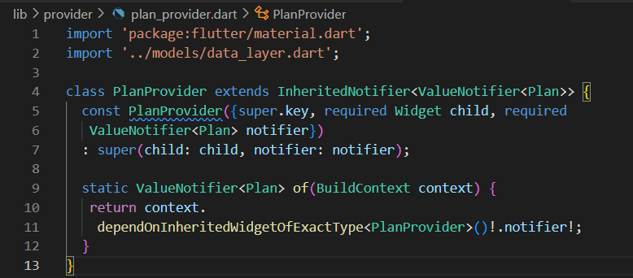

### Langkah 2 : Edit main.dart

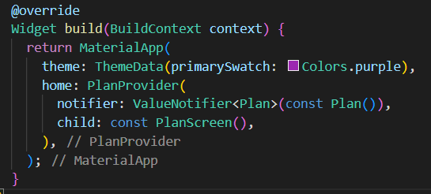

### Langkah 3 : Tambah method pada model plan.dart

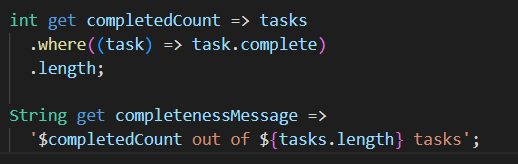

### Langkah 4 : Pindah ke PlanScreen
Edit PlanScreen agar menggunakan data dari PlanProvider. Hapus deklarasi variabel plan (ini akan membuat error). Kita akan perbaiki pada langkah 5 berikut ini.

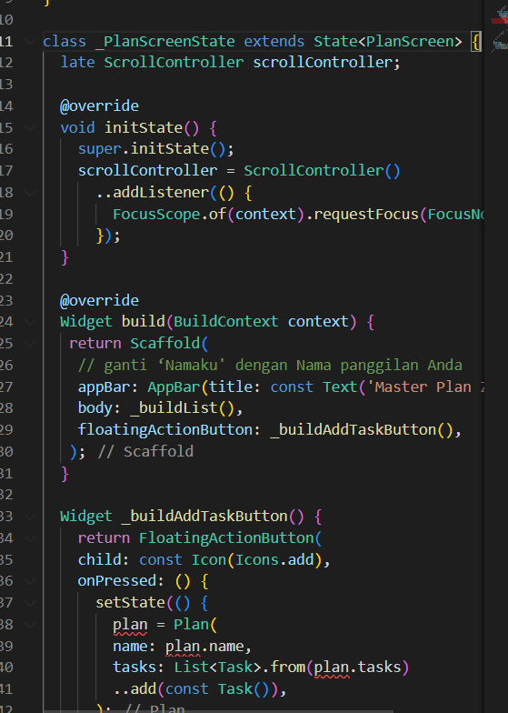

### Langkah 5 : Edit method _buildAddTaskButton

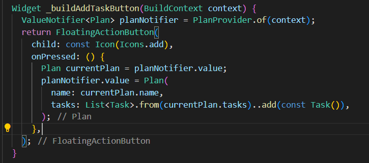

### Langkah 6 : Edit method _buildTaskTile

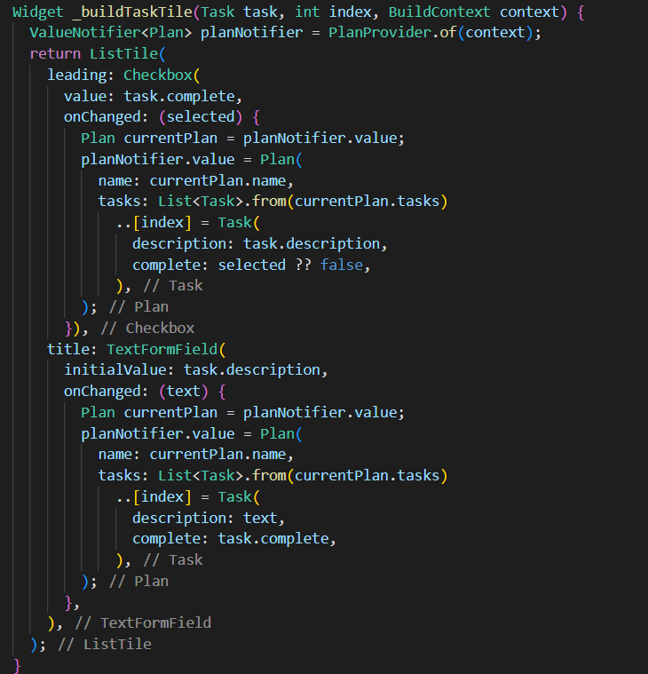

### Langkah 7 : Edit _buildList

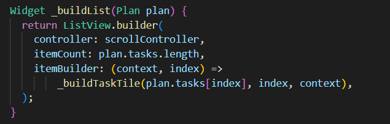

### Langkah 8 : Tetap di class PlanScreen
Edit method build sehingga bisa tampil progress pada bagian bawah (footer). Caranya, bungkus (wrap) _buildList dengan widget Expanded dan masukkan ke dalam widget Column seperti kode pada Langkah 9.

### Langkah 9 : Tambah widget SafeArea

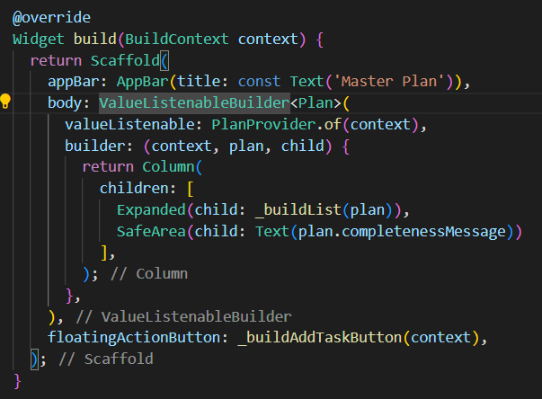

- Hasil

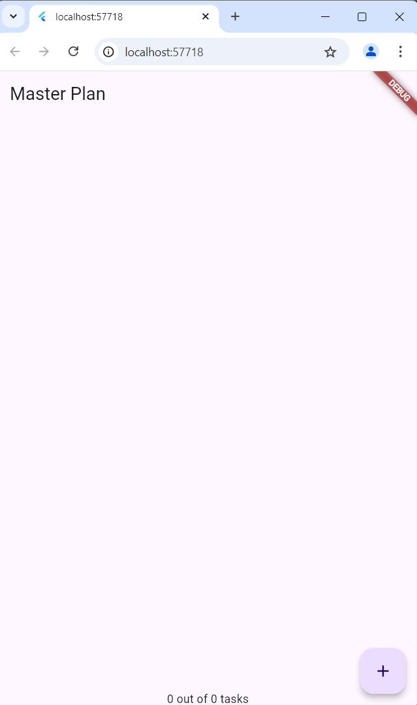

Tidak akan terlihat perubahan pada UI, namun dengan melakukan langkah-langkah di atas, Anda telah menerapkan cara memisahkan dengan baik antara view dan model. Ini merupakan hal terpenting dalam mengelola state di aplikasi Anda.

## Tugas Praktikum 2 : InheritedWidget
1. Selesaikan langkah-langkah praktikum tersebut, lalu dokumentasikan berupa GIF hasil akhir praktikum beserta penjelasannya di file README.md! Jika Anda menemukan ada yang error atau tidak berjalan dengan baik, silakan diperbaiki sesuai dengan tujuan aplikasi tersebut dibuat.
2. Jelaskan mana yang dimaksud InheritedWidget pada langkah 1 tersebut! Mengapa yang digunakan InheritedNotifier?

    - Jawab
        
        Pada langkah 1, PlanProvider adalah turunan InheritedNotifier, yang digunakan untuk membagikan data ValueNotifier<Plan> ke widget-widget turunan secara efisien. Dengan InheritedNotifier, setiap perubahan pada ValueNotifier<Plan> akan otomatis memperbarui widget-widget terkait tanpa perlu melewatkan data secara langsung. Ini lebih efisien dibandingkan InheritedWidget biasa, karena InheritedNotifier hanya merender ulang widget yang memerlukan data ketika terjadi perubahan, sehingga membuat aplikasi lebih responsif.

3. Jelaskan maksud dari method di langkah 3 pada praktikum tersebut! Mengapa dilakukan demikian?

    - Jawab

        Pada langkah 3, dua metode baru ditambahkan ke kelas model Plan untuk menghitung dan menampilkan progres penyelesaian tugas. Metode completedCount menghitung jumlah tugas yang sudah selesai, sedangkan completenessMessage menghasilkan pesan yang menunjukkan berapa banyak tugas yang telah diselesaikan dibandingkan dengan total tugas. Penambahan metode ini memudahkan pengguna untuk melihat status penyelesaian tugas secara langsung.
        
4. Lakukan capture hasil dari Langkah 9 berupa GIF, kemudian jelaskan apa yang telah Anda buat!
5. Kumpulkan laporan praktikum Anda berupa link commit atau repository GitHub ke spreadsheet yang telah disediakan!

## Praktikum 3 : Membuat State di Multiple Screens
### Langkah 1 : Edit PlanProvider

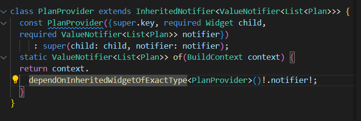

### Langkah 2 : Edit main.dart

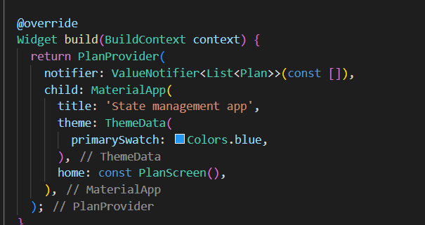

### Langkah 3 : Edit plan_screen.dart

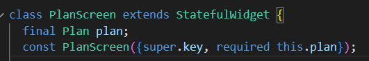

### Langkah 4 : Error

Itu akan terjadi error setiap kali memanggil PlanProvider.of(context). Itu terjadi karena screen saat ini hanya menerima tugas-tugas untuk satu kelompok Plan, tapi sekarang PlanProvider menjadi list dari objek plan tersebut.

### Langkah 5 : Tambah getter Plan

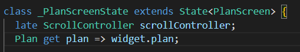

### Langkah 6 : Method initState()

Pada bagian ini kode tetap seperti berikut.

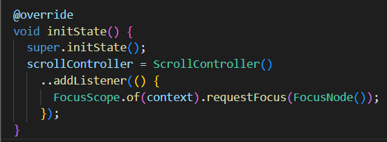

### Langkah 7 : Widget build

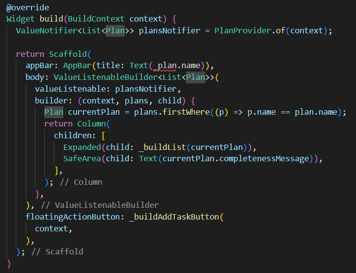

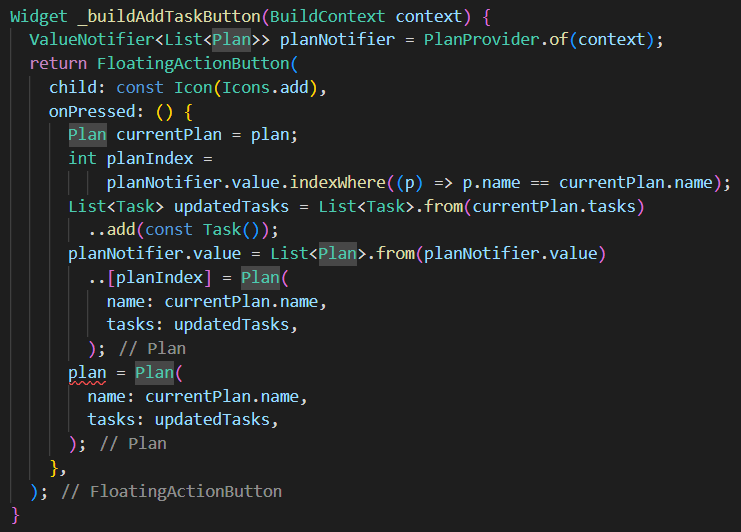

### Langkah 8 : Edit _buildTaskTile

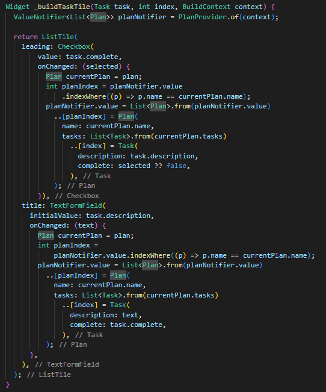

### Langkah 9 : Buat screen baru

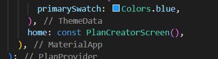

### Langkah 10 : Pindah ke class _PlanCreatorScreenState

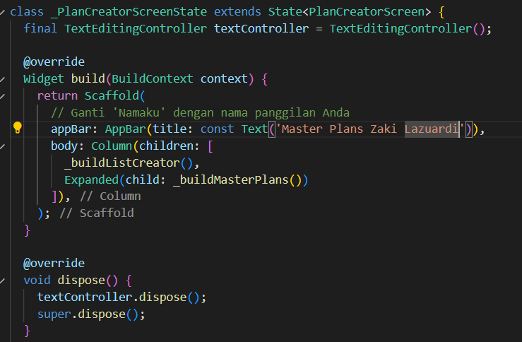

### Langkah 11 : Pindah ke method build

### Langkah 12 : Buat widget _buildListCreator

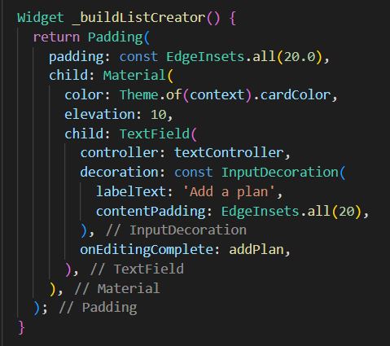

### Langkah 13 : Buat void addPlan()

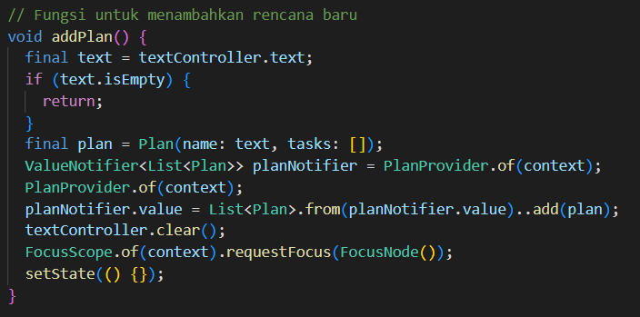

### Langkah 14 : Buat widget _buildMasterPlans()

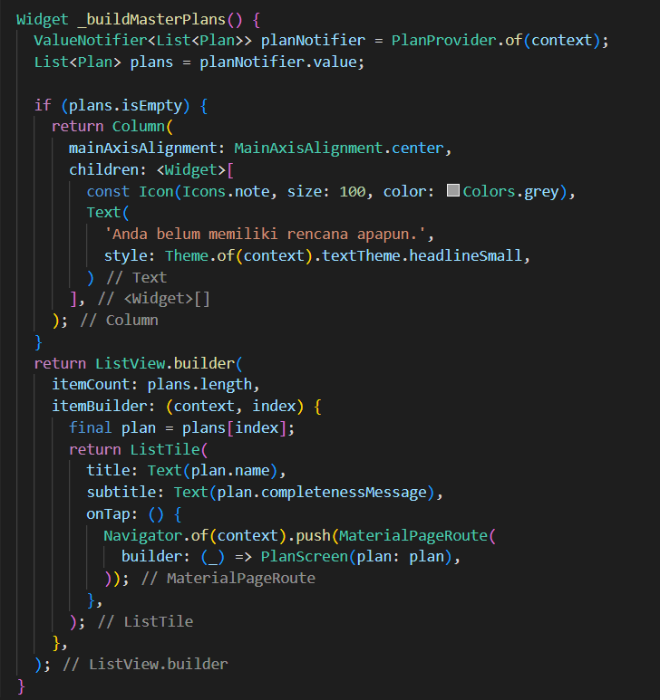

- Hasil

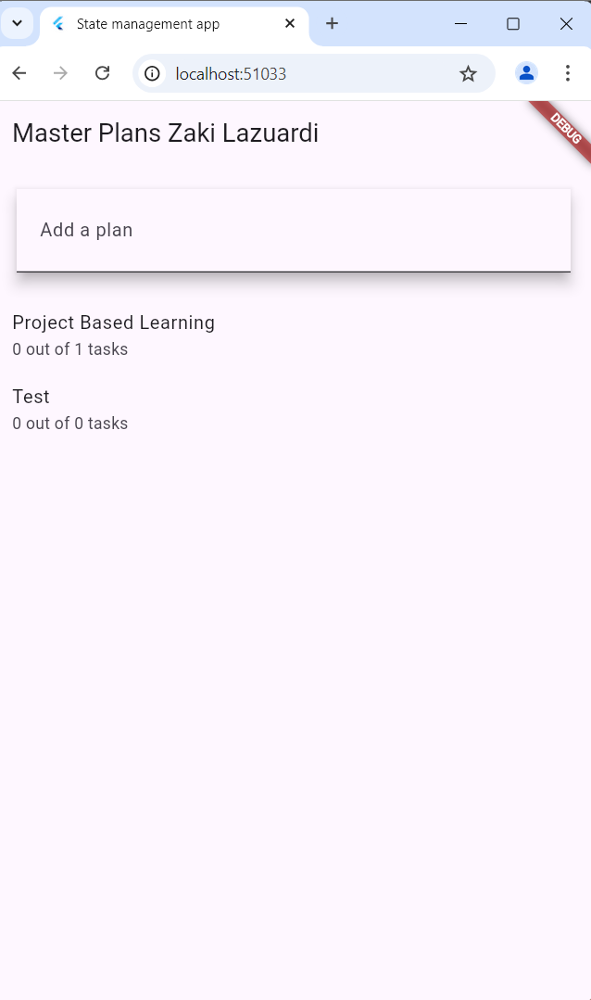

## Tugas Praktikum 3 : State di Multiple Screens
1. Selesaikan langkah-langkah praktikum tersebut, lalu dokumentasikan berupa GIF hasil akhir praktikum beserta penjelasannya di file README.md! Jika Anda menemukan ada yang error atau tidak berjalan dengan baik, silakan diperbaiki sesuai dengan tujuan aplikasi tersebut dibuat.
2. Berdasarkan Praktikum 3 yang telah Anda lakukan, jelaskan maksud dari gambar diagram berikut ini!

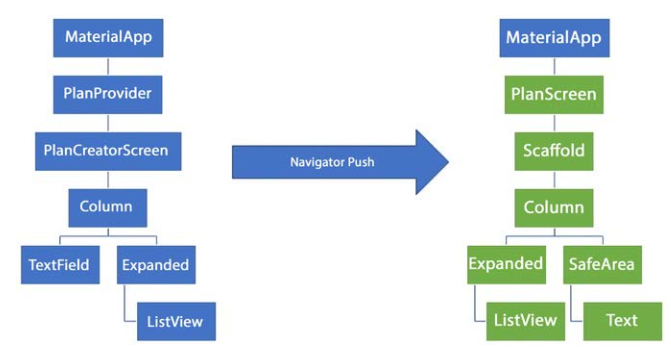

- Jawab
    
    Diagram tersebut menunjukkan perbedaan struktur widget antara dua layar dalam aplikasi Flutter yang diakses melalui navigasi Navigator.push. Di bagian kiri, struktur awal aplikasi dimulai dengan MaterialApp, diikuti oleh PlanProvider sebagai penyedia data, dan kemudian PlanCreatorScreen sebagai layar utama. Di dalam PlanCreatorScreen, terdapat struktur Column yang terdiri dari TextField untuk input teks dan Expanded yang menampung ListView untuk menampilkan daftar item secara scrollable.

    Pada bagian kanan, setelah pengguna melakukan navigasi ke layar PlanScreen dengan Navigator.push, terdapat perubahan struktur widget. PlanScreen menggunakan Scaffold sebagai dasar tata letak untuk menyediakan elemen-elemen seperti AppBar dan FloatingActionButton. Di dalam Scaffold, terdapat Column yang berisi Expanded untuk menampung ListView dan SafeArea yang mengelilingi widget Text. Penggunaan SafeArea di layar baru ini menunjukkan perhatian terhadap kenyamanan tampilan di berbagai perangkat, menghindari area yang mungkin terpotong atau terganggu oleh notch atau elemen layar lainnya. Secara keseluruhan, navigasi ini memungkinkan pemisahan dan pengorganisasian elemen UI yang lebih baik, sehingga aplikasi menjadi lebih modular, responsif, dan nyaman diakses oleh pengguna.

3. Lakukan capture hasil dari Langkah 14 berupa GIF, kemudian jelaskan apa yang telah Anda buat!
4. Kumpulkan laporan praktikum Anda berupa link commit atau repository GitHub ke spreadsheet yang telah disediakan!