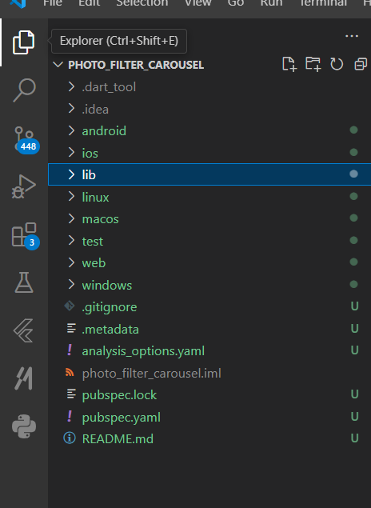
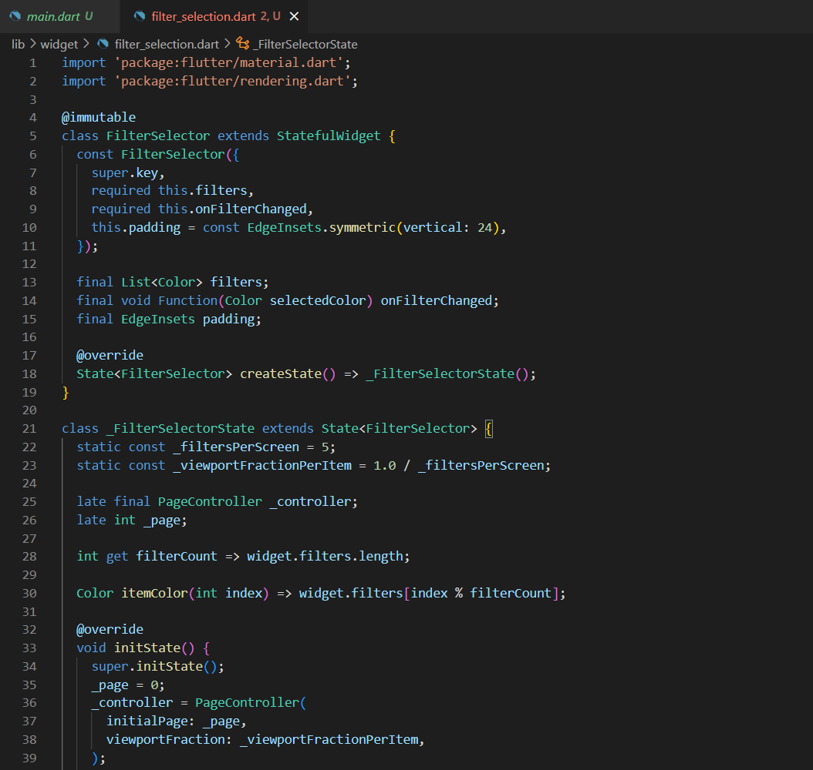
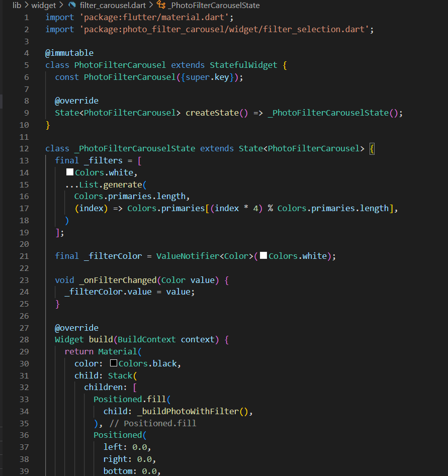
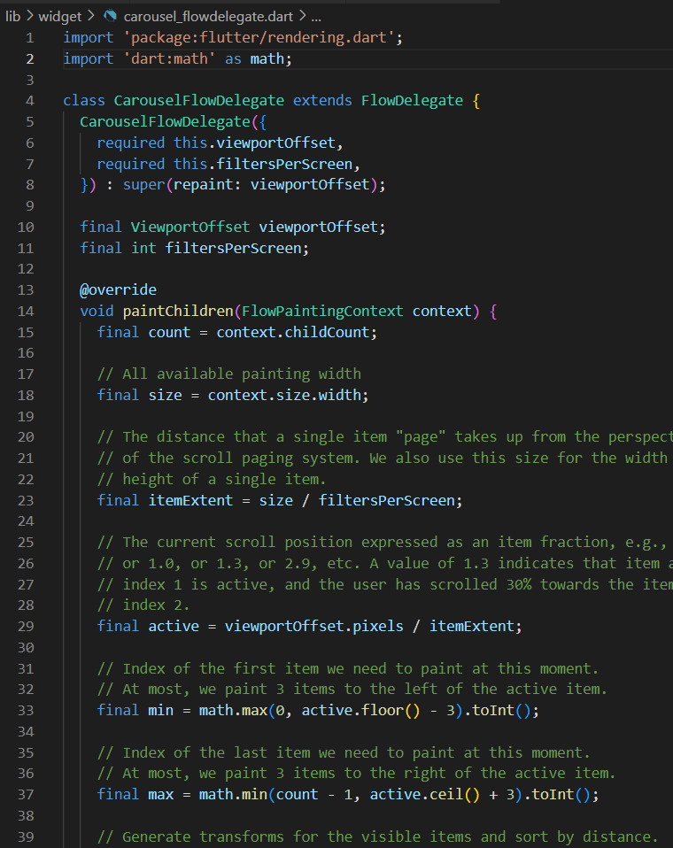
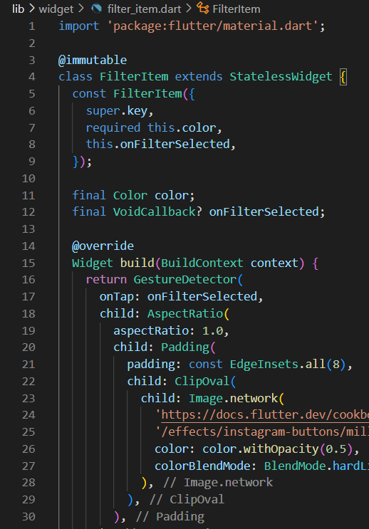
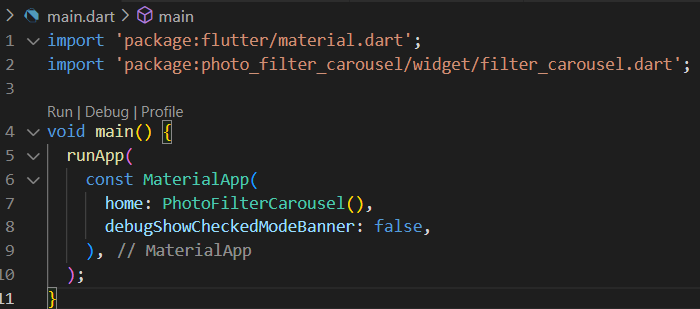

## Praktikum 2 : Membuat Photo Filter Carousel
### Langkah 1 : Buat Project Baru

### Langkah 2 : Buat widget Selector ring dan dark gradient

### Langkah 3 : Buat widget photo filter carousel

### Langkah 4 : Membuat filter warna - bagian 1

### Langkah 5 : Membuat filter warna - bagian 2

### Langkah 6 : Implementasi filter carousel

- Hasil

## Tugas Praktikum
1. Selesaikan Praktikum 1 dan 2, lalu dokumentasikan dan push ke repository Anda berupa screenshot setiap hasil pekerjaan beserta penjelasannya di file README.md! Jika terdapat error atau kode yang tidak dapat berjalan, silakan Anda perbaiki sesuai tujuan aplikasi dibuat!
2. Gabungkan hasil praktikum 1 dengan hasil praktikum 2 sehingga setelah melakukan pengambilan foto, dapat dibuat filter carouselnya!
3. Jelaskan maksud void async pada praktikum 1?

    - Jawab

        Digunakan untuk memulai aplikasi Flutter dengan kamera perangkat, memastikan bahwa plugin layanan seperti kamera diinisialisasi sebelum runApp() dijalankan. Fungsi main() dibuat async untuk menunggu hasil dari availableCameras(), yang mengembalikan daftar kamera yang tersedia di perangkat. Kamera pertama dalam daftar ini kemudian dipilih dan diteruskan ke widget TakePictureScreen untuk digunakan dalam aplikasi. Dengan menggunakan WidgetsFlutterBinding.ensureInitialized() di awal, kode ini memastikan bahwa semua layanan yang dibutuhkan, termasuk kamera, sudah siap digunakan sebelum aplikasi berjalan. Tema gelap diterapkan melalui ThemeData.dark(), dan banner debug disembunyikan dengan debugShowCheckedModeBanner: false.

4. Jelaskan fungsi dari anotasi @immutable dan @override ?

    - Jawab

        Anotasi @immutable dan @override dalam pemrograman Dart dan Flutter berfungsi untuk memberikan informasi tambahan pada kelas atau metode tertentu. Anotasi @immutable digunakan untuk menandai suatu kelas sebagai immutable, artinya setelah objek dari kelas tersebut dibuat, nilai atau atributnya tidak boleh diubah. Ini sangat berguna dalam pengembangan Flutter widget yang stateless karena memastikan bahwa semua properti objek yang bersifat immutable harus ditandai sebagai final. Di sisi lain, anotasi @override digunakan ketika suatu metode atau properti di kelas turunan ingin menimpa (override) metode atau properti serupa dari kelas induk. Penggunaan @override meskipun opsional, sangat disarankan karena dapat membantu mengidentifikasi kesalahan seperti kesalahan penulisan nama metode yang akan di-override atau ketidaksesuaian definisi dengan kelas induk. Kedua anotasi ini mendukung pengembangan kode yang lebih rapi, terbaca, dan minim kesalahan dalam proyek Dart atau Flutter.
        
5. Kumpulkan link commit repository GitHub Anda kepada dosen yang telah disepakati!